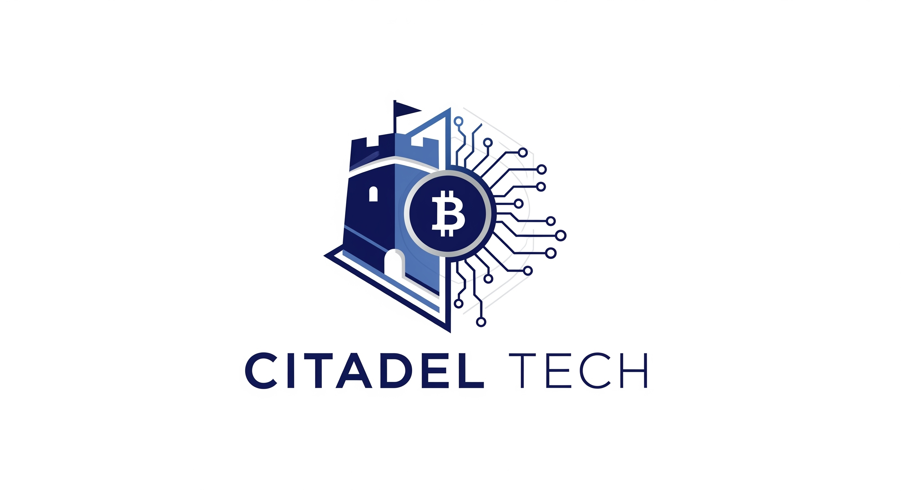

# Citadel Tech

**Next Gen Sovereign Tech Stack**

Citadel maintains a set of libraries and binaries around various Bitcoin protocols that aim to improve individual sovereignty in the new world of decentralized internet.

## About

We focus on building Bitcoin infrastructure that enhances privacy and decentralization, with **Coinswap** being our flagship implementation of the Maxwell-Belcher coinswap protocol for trustless peer-to-peer atomic swaps.

## Core Projects

*Core libraries and applications*

| Project | Repository | Description |
|---------|------------|-------------|
| **Coinswap** | [coinswap](https://github.com/citadel-tech/coinswap) | Functioning, minimal-viable binaries and libraries to perform a trustless, p2p Maxwell-Belcher Coinswap Protocol |
| **Coinswap-FFI** | [coinswap-ffi](https://github.com/citadel-tech/coinswap-ffi) | FFI Interface for the Coinswap client library |
| **Taker-App** | [taker-app](https://github.com/citadel-tech/taker-app) | An example desktop client built in Nodejs using the coinswap-ffi |
| **Coinswap-Docker** | [coinswap-docker](https://github.com/citadel-tech/coinswap/blob/master/docs/docker.md) | Pre-configured Docker setup with `bitcoind(Mutinynet)`, `Tor`, `makerd`, and `maker-cli`, for quick deployment of makers |

## Documentation & Research

*Protocol specifications and experimental implementations*

| Project | Repository | Description |
|---------|------------|-------------|
| **Protocol Specification** | [Coinswap-Protocol-Specification](https://github.com/citadel-tech/Coinswap-Protocol-Specification) | Technical specification for the coinswap protocol |

## Community

Open source is fundamental to our mission and we would love to connect with you.

Join our [Discord server](https://discord.gg/VSTapAXePb) to discuss development, ask questions, and contribute to advancing Bitcoin sovereignty tools!
